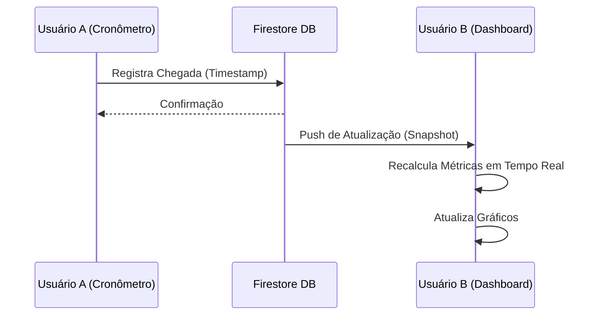

# Desenvolvimento de uma Plataforma Web Fullstack para Análise, Monitoramento e Simulação de Sistemas de Filas em Tempo Real

**Resumo**

Este artigo apresenta o desenvolvimento de uma aplicação web robusta destinada ao estudo e análise prática da Teoria de Filas. A plataforma integra coleta de dados em tempo real, processamento analítico e simulação estocástica, permitindo a estudantes, pesquisadores e gestores operacionais monitorar filas, calcular métricas de desempenho (como tempo de espera e tamanho da fila) e simular cenários hipotéticos. Utilizando tecnologias modernas como Next.js, React e Firebase, o sistema oferece sincronização instantânea entre múltiplos usuários, suportando modelos de filas M/M/1 e M/M/c.

---

## 1. Introdução

A Teoria de Filas é um ramo da pesquisa operacional que estuda o comportamento de linhas de espera. É vital para a otimização de recursos em diversos setores, desde telecomunicações e computação até logística e atendimento ao cliente. A capacidade de prever congestionamentos e dimensionar servidores adequadamente é crucial para a eficiência econômica e a satisfação do usuário.

Embora existam ferramentas teóricas e softwares de simulação complexos, há uma lacuna no mercado para soluções acessíveis, baseadas na web, que permitam a coleta de dados empíricos em tempo real combinada com análise teórica imediata.

Este projeto visa preencher essa lacuna desenvolvendo o **Queueing Theory App**, uma plataforma que permite:
1.  Coleta de dados de chegada e atendimento em tempo real via cronômetros sincronizados.
2.  Cálculo automático de métricas de desempenho baseadas nos modelos de Kendall.
3.  Simulação de cenários discretos para validação de hipóteses.

## 2. Fundamentação Teórica

### 2.1 Notação de Kendall
Para classificar os sistemas de filas, utiliza-se a notação $A/S/c/K/N/D$, onde:
*   **A**: Distribuição dos tempos de chegada (ex: M para Markoviano/Exponencial).
*   **S**: Distribuição dos tempos de serviço (ex: M para Markoviano/Exponencial).
*   **c**: Número de servidores paralelos.
*   **K**: Capacidade do sistema (assumido $\infty$ neste projeto).
*   **N**: Tamanho da população (assumido $\infty$).
*   **D**: Disciplina da fila (assumido FIFO - First In, First Out).

### 2.2 Lei de Little
Uma das leis fundamentais utilizadas pelo sistema é a Lei de Little, que estabelece a relação entre o número médio de clientes no sistema ($L$), a taxa média de chegada ($\lambda$) e o tempo médio no sistema ($W$):

$$ L = \lambda W $$

Esta relação é válida para qualquer sistema de filas em estado estacionário.

### 2.3 Modelos Matemáticos Implementados

#### Modelo M/M/1
Um único servidor com chegadas de Poisson e tempos de serviço exponenciais.
*   Utilização ($\rho$): $\rho = \lambda / \mu$
*   Probabilidade de sistema vazio ($P_0$): $1 - \rho$
*   Número médio no sistema ($L$): $\rho / (1 - \rho)$

#### Modelo M/M/c
Múltiplos servidores ($c$) em paralelo.
*   Utilização ($\rho$): $\lambda / (c\mu)$
*   A probabilidade de ter zero clientes ($P_0$) envolve um somatório complexo das séries de potências de $\lambda/\mu$.
*   O comprimento médio da fila ($L_q$) é derivado usando a fórmula de Erlang-C.

## 3. Arquitetura do Sistema

### 3.1 Tecnologias Empregadas
O sistema foi construído sobre uma arquitetura moderna e escalável:
*   **Frontend**: Next.js (React) para renderização híbrida e roteamento eficiente. Tailwind CSS para estilização responsiva.
*   **Linguagem**: TypeScript, garantindo tipagem estática e redução de erros em tempo de desenvolvimento.
*   **Backend as a Service (BaaS)**: Firebase.
    *   **Firestore**: Banco de dados NoSQL orientado a documentos para armazenamento de filas e registros.
    *   **Authentication**: Gerenciamento seguro de sessões de usuários.
*   **Visualização**: Recharts para gráficos dinâmicos e KaTeX para renderização de fórmulas matemáticas.

### 3.2 Fluxo de Dados em Tempo Real
A característica distintiva da aplicação é a sincronização em tempo real. O Firestore utiliza *listeners* (ouvintes) via WebSockets. Quando um usuário registra uma chegada no cronômetro, o dado é enviado ao servidor, que imediatamente propaga a mudança para todos os clientes conectados àquela sessão.



## 4. Módulos do Sistema

### 4.1 Gerenciamento de Filas e Cronômetros
Este módulo permite a criação de filas do tipo "Chegada" ou "Atendimento".
*   **Cronômetro de Chegada**: Captura o timestamp exato ($t_a$) de cada evento.
*   **Cronômetro de Atendimento**: Gerencia o estado de $c$ servidores. O sistema impede o início de um novo atendimento se todos os servidores estiverem ocupados ($n_{serviço} = c$), garantindo consistência lógica.

### 4.2 Dashboard Analítico
O núcleo de processamento da aplicação. Ele consome os dados brutos (timestamps) e realiza o seguinte algoritmo:
1.  **Pareamento**: Associa eventos de chegada a eventos de saída baseando-se na ordem FIFO.
2.  **Cálculo de Taxas**:
    *   $\lambda = 1 / \overline{T_{entre-chegadas}}$
    *   $\mu = 1 / \overline{T_{serviço}}$
3.  **Inferência de Métricas**: Calcula $L, L_q, W, W_q$ empiricamente e compara com os valores teóricos esperados para M/M/c.
4.  **Visualização**: Plota a distribuição de probabilidades $P(n)$ e a evolução temporal da fila.

### 4.3 Simulação de Eventos Discretos (DES)
Para cenários onde a coleta de dados não é viável, o sistema oferece um simulador.
*   **Algoritmo**: Avanço no tempo baseado no próximo evento (Next-Event Time Advance).
*   **Geração de Variáveis Aleatórias**: Utiliza o método da transformação inversa para gerar tempos exponenciais a partir de uma distribuição uniforme $U(0,1)$:
    $$ T = \frac{-\ln(U)}{\lambda} $$

## 5. Fluxograma de Funcionamento

O diagrama abaixo ilustra o fluxo principal de utilização da plataforma, desde a coleta até a análise.

```mermaid
graph TD
    A[Início] --> B{Modo de Uso}
    B -->|Coleta Real| C[Configurar Filas]
    B -->|Simulação| D[Configurar Parâmetros (λ, μ, c)]
    
    C --> E[Cronômetro de Chegada]
    C --> F[Cronômetro de Atendimento]
    
    E -->|Registro| G[(Database Firestore)]
    F -->|Registro| G
    
    G --> H[Processamento de Dados]
    D --> I[Execução da Simulação]
    
    H --> J[Cálculo de Métricas (L, W, Pn)]
    I --> J
    
    J --> K[Visualização de Gráficos]
    K --> L[Exportação de Relatório]
```

## 6. Estudo de Caso Exemplo

Para validar o sistema, considere um cenário hipotético de uma pequena agência bancária.

**Cenário:**
*   1 caixa atendendo (c=1).
*   Clientes chegam a uma taxa estimada de 30 por hora ($\lambda = 0.5$ clientes/min).
*   O caixa leva em média 1.5 minutos por cliente ($\mu = 1/1.5 = 0.66$ clientes/min).

**Resultados no App:**
Ao inserir esses dados no módulo de **Simulação Personalizada**, o sistema calcula:
*   Utilização ($\rho$): $0.5 / 0.66 = 0.75$ (75% de ocupação).
*   Probabilidade de fila vazia ($P_0$): $1 - 0.75 = 0.25$ (25%).
*   Número médio no sistema ($L$): $0.75 / (1 - 0.75) = 3$ clientes.
*   Tempo médio de espera ($W$): $3 / 0.5 = 6$ minutos.

O gráfico de $P(n)$ gerado pelo sistema mostraria um decaimento exponencial, confirmando a teoria para filas M/M/1.

## 7. Conclusão

O **Queueing Theory App** demonstra como tecnologias web modernas podem ser aplicadas para resolver problemas complexos de engenharia e gestão. A integração entre coleta de dados em tempo real e modelagem teórica oferece uma ferramenta poderosa para ensino e tomada de decisão.

Trabalhos futuros incluem a implementação de distribuições de probabilidade gerais (G/G/c), suporte a redes de filas (Jackson Networks) e otimização de custos baseada em parâmetros econômicos.

## Referências

1.  KENDALL, D. G. Stochastic Processes Occurring in the Theory of Queues and their Analysis by the Method of the Imbedded Markov Chain. The Annals of Mathematical Statistics, 1953.
2.  LITTLE, J. D. C. A Proof for the Queuing Formula: L = λW. Operations Research, 1961.
3.  GROSS, D.; HARRIS, C. M. Fundamentals of Queueing Theory. Wiley-Interscience, 1998.
4.  Next.js Documentation. Disponível em: <https://nextjs.org/>.
5.  Firebase Documentation. Disponível em: <https://firebase.google.com/>.
